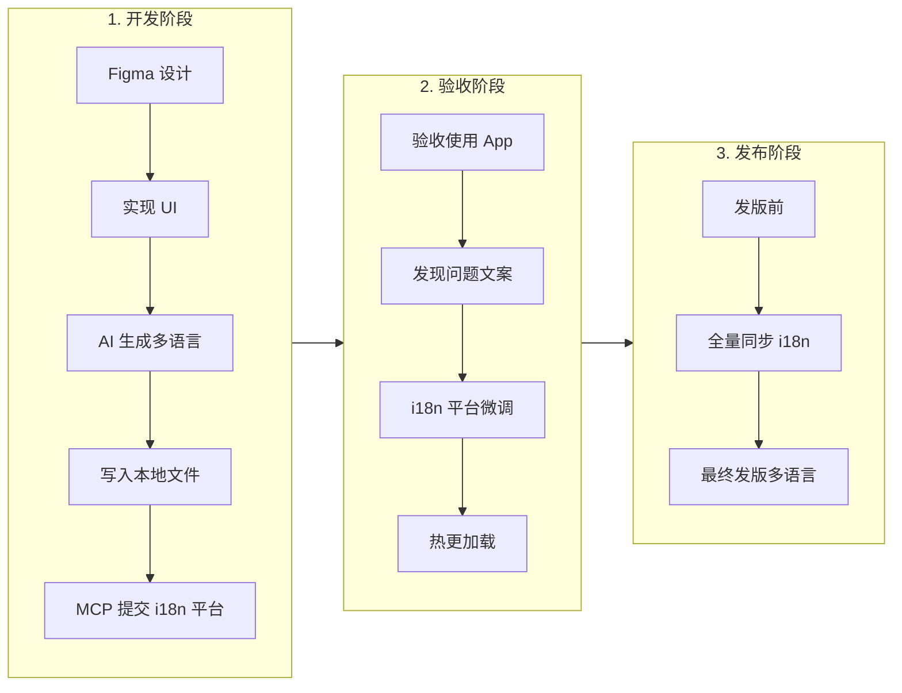
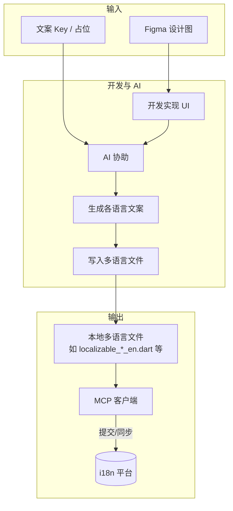
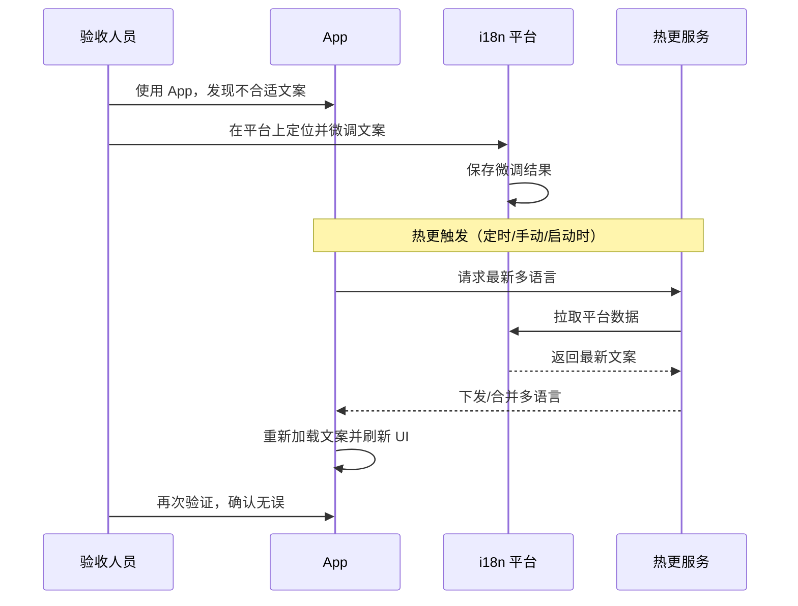
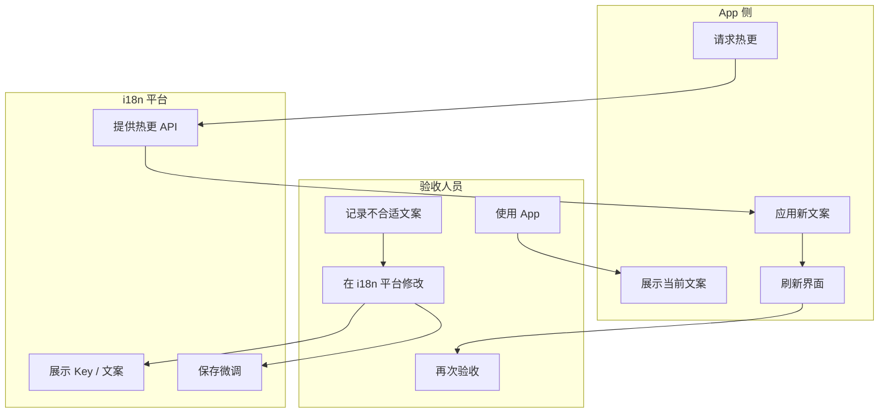
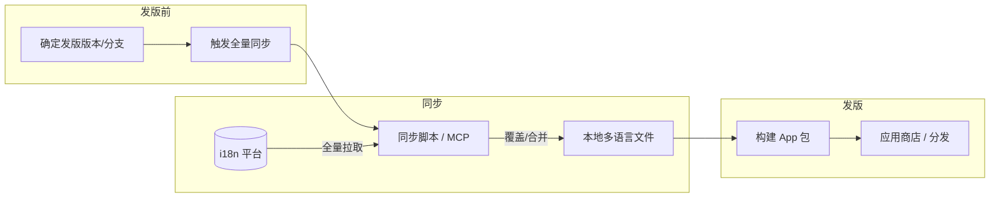
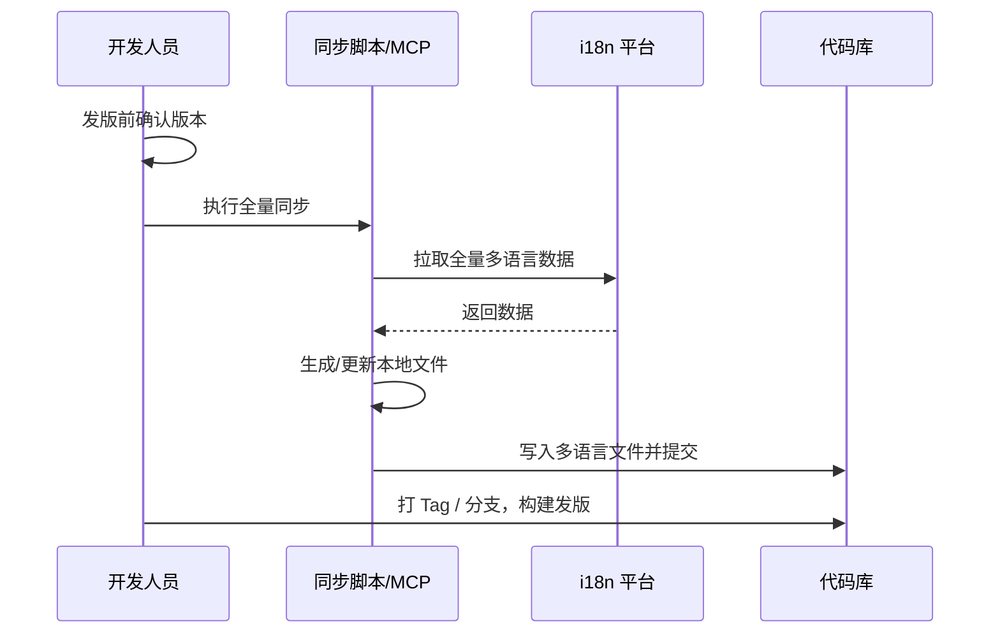
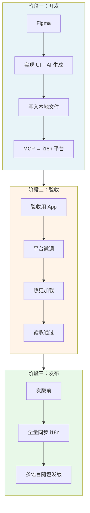

# App 多语言工作流

本文档描述从开发、验收到发布的完整多语言（i18n）工作流程，涵盖 AI 自动生成、i18n 平台协作与热更、发版前全量同步等环节。

---

## 一、工作流总览

三个阶段形成闭环：**开发阶段** 产出初版多语言并推送到 i18n 平台；**验收阶段** 在平台上微调并依赖热更生效；**发布阶段** 全量同步平台数据作为发版多语言。

---

## 二、阶段一：开发阶段

开发根据 Figma 实现 UI，由 AI 自动生成多语言并写入项目内多语言文件，再通过 MCP 将内容提交到 i18n 平台。

### 2.1 流程图

### 2.2 角色与职责

| 角色       | 职责 |
|------------|------|
| 开发人员   | 按 Figma 实现 UI，维护文案 Key；触发 AI 生成并确认写入本地文件；通过 MCP 提交到 i18n 平台。 |
| AI 助手    | 根据设计稿与 Key 生成各语言初版文案，并写入对应多语言文件。 |
| i18n 平台  | 接收并存储多语言数据，供验收微调与热更、发版同步使用。 |

### 2.3 关键产出

- 项目内多语言源文件已更新（如 `lib/localizations/translations/*/localizable_*.dart`）。
- i18n 平台上存在与当前版本对应的多语言数据，作为后续微调与同步的基准。

---

## 三、阶段二：验收阶段

验收人员在真机/模拟器上使用 App，对 AI 生成的文案进行审阅；不合适处在 i18n 平台上微调，App 通过在线热更拉取最新文案并生效。

### 3.1 流程图

### 3.2 验收阶段流程（泳道图）

### 3.3 角色与职责

| 角色       | 职责 |
|------------|------|
| 验收人员   | 在实际使用场景下检查文案；在 i18n 平台上对问题 Key 进行微调，不直接改代码。 |
| i18n 平台  | 提供 Key/文案的查询与编辑；对外提供热更接口（或供热更服务拉取）。 |
| App        | 在适当时机（如启动、定时、手动）拉取平台最新多语言并热更，刷新界面。 |

### 3.4 热更说明

- **时机**：应用启动时、定时轮询、或用户/验收触发「检查更新」。
- **范围**：仅多语言文案，不涉及代码或资源包的大版本更新。
- **策略**：可先拉取增量或全量差异，再合并到当前运行时文案并触发 UI 刷新。

---

## 四、阶段三：发布阶段

在版本发布前，开发将 i18n 平台上的「验收后」数据全量同步回工程，作为该版本的最终发版多语言，随包发布。

### 4.1 流程图

### 4.2 发布阶段时序

### 4.3 角色与职责

| 角色       | 职责 |
|------------|------|
| 开发人员   | 在发版前执行一次「i18n 平台 → 本地」的全量同步，确认多语言文件已提交并参与构建。 |
| 同步工具   | MCP 或脚本从 i18n 平台拉取全量数据，按项目约定写入对应多语言文件。 |

### 4.4 注意事项

- 全量同步应以 **i18n 平台上验收后的数据** 为准，避免覆盖为未验收内容。
- 同步结果需纳入版本控制（如 Git），便于追溯和回滚。
- 若有「仅线上、不发版」的 Key，需在同步规则或平台上做区分，避免误写回工程。

---

## 五、三阶段串联视图

下图为三个阶段在同一视图中的串联关系，便于整体理解。

---

## 六、检查清单（简要）

- **开发阶段**：Figma 已实现 → AI 已生成并写入本地文件 → MCP 已提交 i18n 平台。
- **验收阶段**：验收已在平台上完成微调 → App 热更已验证能加载平台最新文案。
- **发布阶段**：已执行全量同步 → 多语言文件已提交代码库 → 构建包内文案与平台一致。

---

## 七、文档维护

- **文档路径**：`docs/i18n_workflow.md`
- **变更说明**：流程或角色调整时请同步更新本文档及图中的泳道/节点。

若 i18n 平台、MCP 接口或热更策略有具体规范，可在此文档中增加「平台与接口说明」章节，或链接到对应技术文档。
