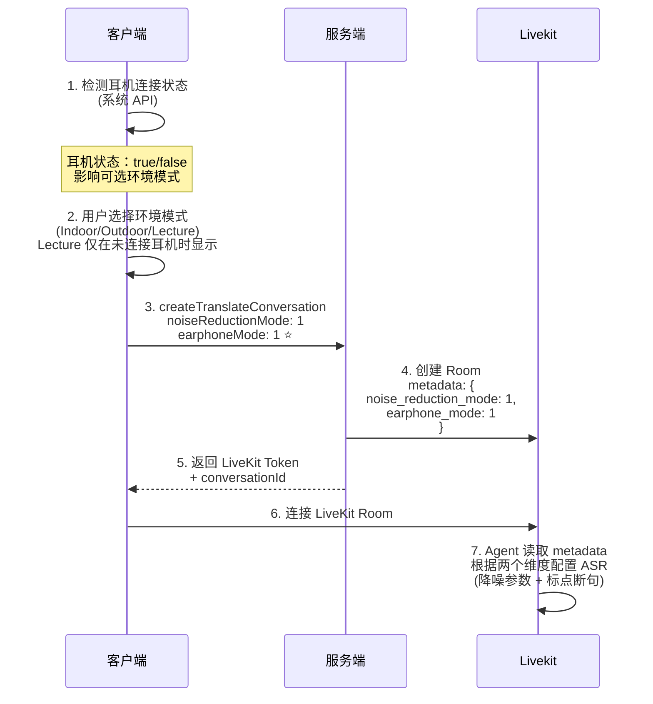

---

## 📋 需求概述

[OT 3.3需求文档-场景模式+克隆AB](https://vocalbeats.sg.larksuite.com/wiki/PB9OwDwWbixKPlkmiX8l9CoOgGg)

本次迭代包含以下核心功能：

1. **降噪模式管理（二维设计）** ⭐：
   - 维度 1：耳机连接状态（硬件检测）
   - 维度 2：环境模式（用户选择：Indoor/Outdoor/Lecture）
   - 支持中途切换耳机和环境模式
2. **耳机模式性能优化**：智能断句 + 快速 TTS
3. **Cartesia 声音克隆接入**：新的高质量声音克隆提供商
4. **订阅页差异化定价**：根据用户属性展示不同价格
5. **系统语言增加法语**

---

## 🎯 降噪模式核心理解 ⭐⭐⭐

### 二维设计模型

| 维度                     | 类型    | 可选值       | 说明       |
| ------------------------ | ------- | ------------ | ---------- |
| **维度 1：耳机连接状态** | Boolean | true / false | 由系统检测 |
| **维度 2：环境模式**     | Integer | 1, 2, 3      | 用户选择   |

### 环境模式枚举（3 种）

| Mode ID | 英文名称 | 中文名称 | 未连接耳机 | 已连接耳机 | 说明                                                         |
| ------- | -------- | -------- | ---------- | ---------- | ------------------------------------------------------------ |
| **1**   | Indoor   | 室内模式 | ✅ 可用     | ✅ 可用     | Balanced noise reduction for indoor nearby conversations     |
| **2**   | Outdoor  | 户外模式 | ✅ 可用     | ✅ 可用     | Enhanced noise canceling lets you focus on your conversations |
| **3**   | Lecture  | 讲座模式 | ✅ 可用     | ❌ 不可用   | Focuses on voices from a distance                            |

**关键规则**：

- ⚠️ **Lecture (3) 仅在未连接耳机时可用**
- ✅ Indoor 和 Outdoor 在所有状态下都可用
- 🎧 耳机模式下自动启用标点断句和子句 TTS

---

## 🔄 前后端交互时序图

### 时序图 1: 降噪模式选择（含耳机检测）⭐



---

### 时序图 3: Cartesia 声音克隆

暂时无法在飞书文档外展示此内容

---

### 时序图 4: 订阅页差异化定价

---

暂时无法在飞书文档外展示此内容

---

### 时序图 5: 耳机模式性能优化

暂时无法在飞书文档外展示此内容

---

## 📡 协议详情

### Thrift IDL 协议⭐

| 协议名                                                       | 入参字段详细说明                                             | 出参字段详细说明                                             |
| :----------------------------------------------------------- | :----------------------------------------------------------- | :----------------------------------------------------------- |
| **getSystemBusinessProperties**`fm.hongmaodan.deeptran.protocol.system.service.SystemCommonService/getSystemBusinessProperties` | 无                                                           | **suggestVoiceCloneProvider**: i32 - 推荐的声音克隆提供商（1=MiniMax, 2=Microsoft 3=Cartesia）**paymentAnimation****订阅页支付过渡特效**0 - 无特效1 - 有特效backgroundPushRecallConfigrecallPeriod压后台推送召回周期*1-日,2-周,3-月,4-年,5-终身*recallFrequency周期内推送召回的次数，0 次代表不召回pushTitle推送标题pushContent推送内容JSON 字符串 |
| **createTranslateConversation**`fm.hongmaodan.deeptran.protocol.auth.service.DeepTranService/createTranslateConversation` | `• subscribeToken: string • channel: string • sourceLanguage: string - 源语言（可选，"auto-detect"为自动识别） • targetLanguage: string - 目标语言 • autoPlay: bool - 是否自动播放 • provider: i32 (optional) - 提供商（1=azure, 2=livekit） • sceneId: i32 (optional) - 翻译场景ID • **noiseReductionMode**: i32 - 降噪模式 (1=Indoor, 2=Outdoor, 3=Lecture) • **ttsSpeed**: double - TTS 语速 0.5～2.0` | `conversationId: string livekitUrl: string token: string roomName: string` |
| **generateVoiceClone**`fm.hongmaodan.deeptran.protocol.voiceclone.service.VoiceCloneService/generateVoiceClone` | `• subscribeToken: string • channel: string • voiceFile: binary - 录制的音频样本 • sampleText: string - 克隆后示例音频的文本 • retryGenerate: bool (optional) - 是否为重试请求 • voiceCloneProvider: i32 （1=MiniMax, 2=Microsoft 3=Cartesia • sampleLanguage: string - 示例文本的语言,如 en-US` | `• voiceId: string - 声音ID • provider: string - 提供商 1=MiniMax, 2=Microsoft 3=Cartesia • sampleAudioUrl: string - 示例音频URL` |
| createNote                                                   | 入参sessionId客户端生成的翻译会话 ID（多次暂停保持唯一）     |                                                              |
| checkImageTranslateRight/fm.hongmaodan.deeptran.protocol.auth.service.DeepTranService/checkImageTranslateRight | 入参subscribeTokenchannel出参allowed是否支持图片翻译true 支持 |                                                              |

### HTTP SSE 协议⭐

| 接口             | HTTP 端点                   | 请求参数                            | SSE 事件格式                                                 |
| :--------------- | :-------------------------- | :---------------------------------- | :----------------------------------------------------------- |
| **流式** **TTS** | `POST /deeptran/tts/stream` | text待播放文本language文本语言en-US | **SSE 事件流**:**audio_chunk**{"chunk": "base64音频", "index": 0, "format": "pcm_s16le", "sampleRate": 16000}**complete**{"totalChunks": 120, "duration": 3.5}**error**（错误）:{"code": 5001, "message": "error"} |

### LiveKit Agent 协议

#### RPC 协议⭐⭐⭐

| RPC 方法                 | 调用时机               | 入参字段                                                     | 出参字段                                                     | 说明                               |
| ------------------------ | ---------------------- | ------------------------------------------------------------ | ------------------------------------------------------------ | ---------------------------------- |
| **update_earphone_mode** | 用户连接/断开耳机      | `{  "earphoneConnected": true,  "earphoneLanguage": "en-US" }` | `*{*    *"status"**:* *"ok"**,*    *"earphoneConnected"**:* *true**,*    *"earphoneLanguages"**:* *[**"en-US"**],*    *"punctuationModeEnabled"**:* *true* *}*` | 更新耳机模式（标点断句 + 子句TTS） |
| **play_sentence**        | 用户点击播放按钮时     | • text: string • language: string • request_id: string       | • status: "ok"                                               | 播放指定句子                       |
| **set_auto_play**        | 用户切换自动播放开关时 | • languages: List<{lang: string, enable: bool}>              | • status: "ok" • languages: List<object>                     | 设置自动播放                       |
| **stop_play_sentence**   | 用户点击停止按钮时     | • request_id: string                                         | • status: "ok"                                               | 打断 TTS 播放                      |
| **finalize_stt**         | iOS 长按模式松开时     | 无                                                           | • status: "ok"                                               | 结束 STT                           |

---

**入参**:

```JSON
{
  "modeId": 2  // 降噪模式 ID：1=Indoor, 2=Outdoor, 3=Lecture
}
```

**出参**:

```JSON
// 成功
{
  "status": "ok",
  "appliedModeId": 2,              // 实际应用的模式 ID（可能降级）
  "availableWithEarphone": true    // 该模式是否支持耳机模式
}

// 失败
{
  "status": "error",
  "message": "Invalid mode id"
}
```

---

#### updateEarphoneMode（更新耳机模式）⭐⭐⭐

**用途**: 用户手动启用/禁用耳机模式（标点断句 + 子句 TTS）

**调用方式**:

```Dart
// Flutter 示例
String response = await room.localParticipant.performRpc(
  "updateEarphoneMode",
  jsonEncode({"enabled": true})  // 启用耳机模式
);
```

**入参**:

```JSON
{
  "enabled": true  // true=启用耳机模式, false=禁用耳机模式
}
```

**出参**:

```JSON
// 成功
{
  "status": "ok",
  "earphoneModeEnabled": true,       // 耳机模式是否启用
  "punctuationModeEnabled": true,    // 标点断句是否启用
  "subSentenceTtsEnabled": true      // 子句 TTS 是否启用
}

// 失败（当前降噪模式不支持耳机模式）
{
  "status": "error",
  "message": "Earphone mode is not supported in Lecture mode"
}
```

---

#### Data Packets 交互协议（统一表格）

| Topic               | 发送方向       | 调用时机                   | 传输模式                            | Payload 结构                                                 | 说明             |
| :------------------ | :------------- | :------------------------- | :---------------------------------- | :----------------------------------------------------------- | :--------------- |
| **translator_data** | Agent → Client | STT 识别到语音并完成翻译后 | Final: reliable Interim: unreliable | • sentence_id: int • **sub_sentence_id**: int • text: string • translation: string • is_final: bool • source_language: string • target_language: string • timestamp: float | 翻译数据广播     |
| **tts_playback**    | Agent → Client | TTS 开始/完成/中断时       | reliable                            | • event: "started"\|"completed"\|"interrupted" • request_id: string • language: string • timestamp: float | TTS 播放状态事件 |
| **session_events**  | Agent → Client | Session 结束时             | reliable                            | • event: "session_ended" • reason: string • timestamp: float | Session 结束事件 |

---

#### translator_data Payload 详细定义

```TypeScript
interface TranslatorDataPayload {
  sentence_id: number;           // 完整句子 ID（final 事件时递增）
  sub_sentence_id: number;       // 子句 ID（断句时递增）⭐ 新增
  text: string;                  // 识别的文本
  translation: string;           // 翻译结果
  is_final: boolean;             // 是否为 final 事件
  source_language: string;       // 源语言
  target_language: string;       // 目标语言
  timestamp: number;             // Agent 发送事件时生成的时间戳
}
```

**示例**:

```JSON
{
  "sentence_id": 1,
  "sub_sentence_id": 1,
  "text": "你好。",
  "translation": "Hello.",
  "is_final": false,
  "source_language": "zh-CN",
  "target_language": "en-US",
  "timestamp": 1703123456.145084
}
```